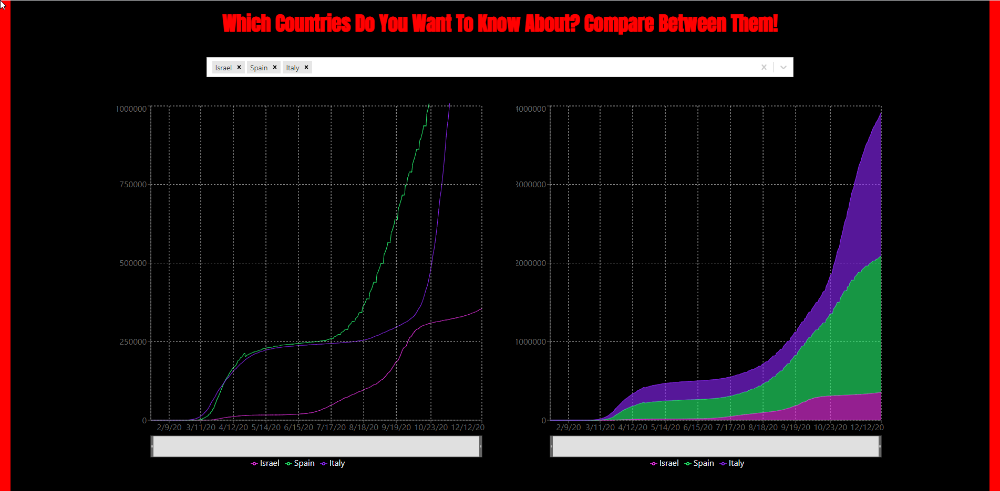
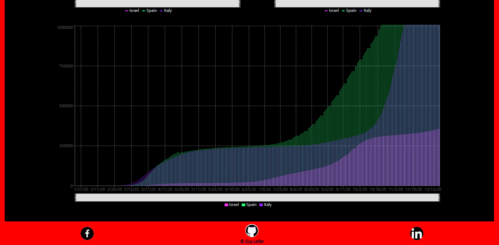
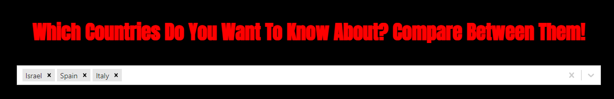
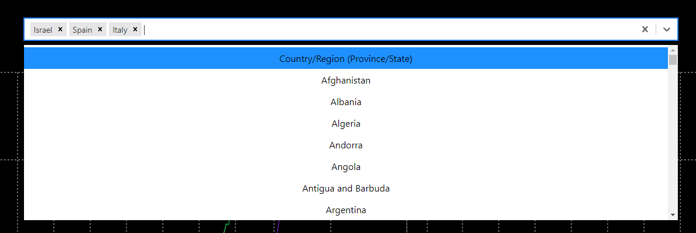

# Corona Virus Charts
## Enjoy The Corona Virus Charts Service!
    this is a repository of a Corona Virus Charts Service.
    the service offers a three different charts of population infected in selected countries by user.
###
the repository use recharts package and uses React.

## Instructions To Users
1. clone this repo to your device. 
2. open the folder in your editor. 
3. in the main folder run the command "npm i".
4. in the main folder run the command "docker-compose build".

## Home Page
    the home page contains a dashboard with three charts 

## Selected Bar
    the service conatains a navigation bar for searching a specific link/s

## ENJOY!